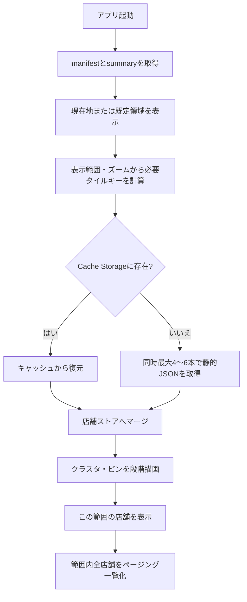

# タイル単位の店舗データ分割読込 — 詳細設計

## 1. 結論

現行の「全店舗座標付きJSONを初回にまとめて読み込む」方式は、対象4地域だけであれば実用的です。一方で、スマートフォンで地図を開くという利用目的では、画面外の店舗情報まで初回にダウンロード・JSON解析・メモリ保持する必要はありません。**地図の表示範囲に対応した店舗タイルだけを取得する構成**に移すと、初期表示・ズーム操作・メモリ使用量を改善できます。

ただし、単純に全店舗JSONをタイルへ分割するだけでは、現在の「全域キーワード検索」「ジャンル別全件数」「地図範囲内の全店舗一覧」を維持できません。本設計では、軽量な全域索引と詳細タイルを分離します。これにより、初期地図表示は必要な地域だけを読み込み、検索や一覧表示は明示操作に応じて必要な索引・タイルを追加取得できます。

> **推奨案:** 「全域サマリー + 遅延読込検索索引 + ズーム別集約タイル + 詳細店舗タイル」の4層構成です。現行の静的GitHub PagesとLeafletを維持し、サーバーAPIやAPIキーを増やさずに導入できます。

## 2. 現行方式と課題

現行アプリでは、月次更新時に対象4地域の公式COIN+店舗CSVから座標付き店舗データを生成しています。公開版では約11,000件の座標付き店舗を扱い、ブラウザ側でクラスタリング、表示範囲内一覧、ジャンル絞り込みを実行します。初期描画ではピンを段階化していますが、店舗データそのものは表示範囲にかかわらずクライアントへ読み込まれます。

| 観点 | 現行の一括JSON | タイル分割後 |
|---|---|---|
| 初期通信 | 全対象地域の店舗データ | 初期画面周辺のサマリーと数個の詳細タイル |
| JSON解析 | 全店舗を一度に解析 | 必要なタイル単位で小さく解析 |
| ピン描画 | ブラウザ内の全座標から候補を選定 | 表示範囲の座標だけを候補化 |
| 地図移動 | クライアント内フィルタリング中心 | 未読範囲のタイルを追加取得 |
| 全域検索 | 初期データだけで即時検索 | 検索開始時に軽量索引を遅延取得 |
| 更新 | 単一データセットを差替え | バージョン付きマニフェストとタイル群を差替え |

この変更の中心は、**店舗の詳細情報を「地図のどこを見ているか」で分割する**ことです。地図パン・ズームが確定した`moveend`イベントを契機に、表示範囲と少しの先読み余白に重なるタイルだけを計算します。Leafletでは`moveend`と地図境界・ズーム情報を利用できるため、この操作は既存の地図ライフサイクルへ自然に統合できます。[1]

## 3. 推奨データ構造

### 3.1 配信レイアウト

すべてのファイルはGitHub Pagesの静的ファイルとして、データセットのバージョンをパスに含めて公開します。バージョンをURLに含めることで、新しい月次データを公開しても端末に保存された旧タイルと衝突しません。

```text
data/
  manifest.json
  2026-09-01/
    summary.json
    search-index.json
    overview/z10/{x}/{y}.json
    stores/z14/{x}/{y}.json
```

| ファイル | 初期読込 | 主な内容 | 想定用途 |
|---|---:|---|---|
| `manifest.json` | 常に | バージョン、作成日時、座標件数、スキーマ、各索引URL | 更新検知 |
| `summary.json` | 常に | 地域別・ジャンル別件数、対象地域境界、タイル設定 | 初期UIとフィルター件数 |
| `overview/z10` | 低ズーム時のみ | タイル内のジャンル別件数・重心・代表クラスタ | 広域地図の軽量表示 |
| `stores/z14` | 地図範囲に応じて | 店舗ID、名称、住所、ジャンル、緯度・経度、詳細導線用情報 | 個別ピン、範囲内一覧、詳細シート |
| `search-index.json` | 検索開始時のみ | 正規化済み名称・住所・ジャンル・地域・詳細タイルキー | 全域キーワード検索 |

### 3.2 詳細タイルのレコード形式

詳細タイルは、画面描画に必要な店舗情報だけを持つ配列にします。JSONのキー重複を減らすため、タイル単位では短い配列形式を用い、`schema`で列の順序を宣言します。

```json
{
  "schema": ["id", "name", "address", "area", "genre", "lat", "lng", "level"],
  "stores": [
    ["kyoto-001", "店舗名", "京都府京都市…", "京都市", "飲食店（カフェ・スイーツ）", 35.0112345, 135.7689012, 6]
  ]
}
```

店舗は**1つの詳細タイルにだけ所属**させます。境界付近の表示抜けは、クライアント側で現在の可視範囲を`pad(0.25)`程度拡張して隣接タイルも取得することで防ぎます。Web Mercatorのスリッピーマップタイル座標は緯度・経度から決定でき、Leafletのタイル体系とも整合します。[2]

### 3.3 ズーム別の役割分担

固定ズーム14の詳細タイルだけでは、低ズーム時に多数のファイルを要求する可能性があります。そのため、低ズームでは店舗個票を要求せず、ビルド時に作った集約タイルを使います。

| 地図ズーム | 表示データ | UI表現 | 通信方針 |
|---:|---|---|---|
| 〜10 | `overview/z10` | 地域・ジャンル別の集約クラスタ | 数個の小さい集約タイルだけ取得 |
| 11〜12 | `overview/z10` + 必要なら詳細タイル | クラスタ中心、代表件数 | 先読みを限定 |
| 13〜14 | `stores/z14` | 店舗ピンとクラスタ | 表示範囲 + 隣接タイルを取得 |
| 15以上 | `stores/z14` | 個別店舗ピン | 画面内タイルを優先取得 |

中心市街地で1つのz14タイルに多くの店舗が密集する場合は、**上限250店舗**を超えたタイルだけz15へ再分割する適応的クアッドツリーを採用します。マニフェストに分割済みのタイルキーを記録すれば、タイルの不均一な密度に対応できます。

## 4. クライアントの読込フロー



実装では、地図移動のたびに直ちに通信せず、`moveend`後に120〜200ms程度デバウンスします。前の範囲の要求は`AbortController`で中止し、最新の範囲だけを反映します。すでに取得したタイルは`Cache Storage`へ保存し、同一バージョン内では再利用します。Cache StorageはHTTPリクエストとレスポンスのペアを保持するブラウザ標準のキャッシュ機構であり、静的タイルとの相性が良好です。[3]

```ts
const needed = tilesForBounds(map.getBounds().pad(0.25), map.getZoom());
const missing = needed.filter(key => !tileStore.has(key));
await fetchWithConcurrency(missing, 4, signal);
```

ピン描画は、現在実装している「初期300件、450件ずつ追加」という方式を維持できます。ただし、候補母集団が全店舗ではなく可視タイルの店舗に変わるため、ズーム時の候補選定コストと不要なマーカー生成をさらに減らせます。

## 5. 検索・フィルター・一覧の設計上の重要点

タイル分割で最も注意すべき点は、**全域検索は地図に表示されているタイルだけでは完結しない**ことです。現行の機能を落とさないため、次のように要求ごとにデータを読み分けます。

| ユーザー操作 | 読み込むデータ | 処理 |
|---|---|---|
| 初期表示 | `summary` + 現在地周辺タイル | 近隣クラスタ・ピンを表示 |
| エリア・ジャンル選択 | `summary` + すでに読込済みタイル | 件数と地図を即時更新。未読地域は操作に応じて追加取得 |
| キーワード入力 | `search-index`を初回だけ遅延取得 | 一致する店舗IDと詳細タイルキーを求める |
| 検索結果を地図表示 | 一致IDに対応する詳細タイル | ピンと一覧を表示 |
| 「この範囲の店舗を表示」 | 現在範囲と交差する詳細タイル全て | 範囲内店舗を全件抽出し、100件ずつ表示 |

`search-index`は初期ロードに含めません。ユーザーが検索欄に文字を入力した時点で取得し、端末に保存します。これにより、現在地近くを地図で探すだけのユーザーは全域の住所・店舗名称の検索索引を受信せずに済みます。

## 6. ビルド・月次更新の設計

現行の座標生成処理に、`build_tile_dataset.py`を追加します。処理は次の順です。

1. 公式CSVを取得し、対象4地域に絞り込みます。
2. `jageocoder`で住所代表点を生成し、座標未取得店舗を記録します。
3. 座標付き店舗をz14のタイルキーへ割り当てます。
4. タイルごとの店舗数が上限を超える場合だけz15へ分割します。
5. z10の集約クラスタ、地域・ジャンル集計、検索索引、マニフェストを生成します。
6. 次の品質検査に通過した場合だけ、バージョン付きディレクトリをPages成果物へ含めます。

| 品質検査 | 判定条件 |
|---|---|
| ID完全性 | タイル内IDの和集合が座標付き店舗ID集合と一致する |
| 重複排除 | 同じ店舗IDが複数タイルに出現しない |
| 座標範囲 | 対象地域の境界外座標を拒否する |
| 集約整合 | z10クラスタの件数合計が詳細タイルの件数合計と一致する |
| タイル容量 | 1ファイルの非圧縮サイズが目標値を超えた場合は子タイルへ分割する |
| 検索整合 | 検索索引のIDが詳細タイルに必ず存在する |

GitHub Actionsは現在の月次実行を維持し、データバージョンをパスに付与した成果物を公開します。`manifest.json`だけは短いTTLまたは`no-store`で更新を確認し、詳細タイルは長期キャッシュ可能なバージョン付きURLで配信します。静的GitHub Pagesでも、バージョニングによって古いキャッシュと新データを安全に共存させられます。[4]

## 7. 移行メリットとコスト

| 観点 | 主なメリット | 注意点・コスト |
|---|---|---|
| 初期表示 | 画面外の店舗詳細を読まないため、低速回線での開始を軽くできる | `summary`と初期タイルの設計が必要 |
| ズーム操作 | 候補店舗・マーカー生成が表示範囲に限定される | タイル取得待ちのローディング表現が必要 |
| メモリ | 一度に保持する店舗詳細を減らせる | LRU上限と削除方針を決める必要がある |
| 通信量 | 近隣検索だけなら大幅に削減できる | 広域で全件一覧を開く操作では、結局多数タイルを取得する |
| 検索 | 検索機能を遅延読込にできる | 検索索引の生成・更新を追加する |
| 更新 | 変更されたタイルだけを取得できる設計へ発展可能 | バージョン・マニフェスト・品質検査が増える |
| 運用 | APIキーや専用サーバーを増やさず維持できる | ビルド時間と成果物ファイル数が増える |

このアプリでは、特に**現在地周辺を開くユーザー**、**スマートフォン回線のユーザー**、**地図を何度もズームするユーザー**に効果があります。一方で、対象4地域・約11,000店舗という現規模では、改善幅は「初期ロード体感と操作中の安定性」に集中します。全域検索を常用する利用者にとっては、検索索引を読み込む時点で一定の通信量が発生します。

## 8. 段階的な移行計画

| 段階 | 実施内容 | 既存機能への影響 | 完了条件 |
|---|---|---|---|
| 0. 計測 | 現行JSONの転送量・解析時間・メモリ・ズーム時フレーム落ちを計測 | なし | 改善目標を数値化 |
| 1. 二重生成 | 一括JSONを残したまま、詳細タイルとマニフェストをビルド | なし | ID数・座標数・地域別件数が一致 |
| 2. 地図のみ切替 | フィーチャーフラグでピン取得をタイル方式へ切替 | 一覧・検索は一括JSONのまま | 地図範囲移動とクラスタが安定 |
| 3. 範囲内一覧切替 | 「この範囲の店舗を表示」をタイル結合結果に切替 | 範囲一覧が全件表示 | 範囲内件数が旧方式と一致 |
| 4. 検索索引導入 | キーワード入力時だけ検索索引を遅延取得 | 検索開始時に初回読込 | 名称・住所・ジャンル検索が一致 |
| 5. 一括JSON廃止 | フォールバック期間後に一括詳細JSONを削除 | 初期通信を最小化 | エラー率・表示性能が目標達成 |

最初から一括JSONを削除せず、**段階1〜3で旧方式を安全なフォールバックとして残す**ことを推奨します。静的配信では障害時にサーバー側で補正できないため、マニフェスト取得や1タイル取得に失敗した場合は、直近のCache Storageデータまたは旧一括JSONへ戻る導線を用意します。

## 9. 実装の優先順位

最初の実装では、z14固定の詳細タイル、`summary.json`、表示範囲のタイル計算、Cache Storage、最大4並列取得までに絞ります。適応的クアッドツリー・検索索引・低ズーム集約タイルは、計測結果を見て次の段階で追加します。この順序なら、現在のLeaflet・GitHub Pages・月次Actionsを保ったまま、リスクを限定して性能改善を検証できます。

## 参考資料

[1] [Leaflet — Map events](https://leafletjs.com/reference.html#map-event)

[2] [OpenStreetMap Wiki — Slippy map tilenames](https://wiki.openstreetmap.org/wiki/Slippy_map_tilenames)

[3] [MDN — CacheStorage](https://developer.mozilla.org/en-US/docs/Web/API/CacheStorage)

[4] [GitHub Docs — Configuring caching for your website](https://docs.github.com/en/pages/getting-started-with-github-pages/configuring-a-publishing-source-for-your-github-pages-site)
